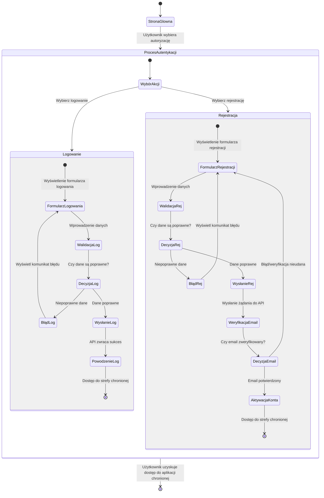

```mermaid
stateDiagram-v2
  [*] --> StronaGlowna
  StronaGlowna --> ProcesAutentykacji: Użytkownik wybiera autoryzację

  state ProcesAutentykacji {
    [*] --> WybórAkcji

    WybórAkcji --> Logowanie: Wybierz logowanie
    WybórAkcji --> Rejestracja: Wybierz rejestrację

    state Logowanie {
    [*] --> FormularzLogowania: Wyświetlenie formularza logowania
    FormularzLogowania --> WalidacjaLog: Wprowadzenie danych
    WalidacjaLog --> DecyzjaLog: Czy dane są poprawne?
    DecyzjaLog --> BłądLog: Niepoprawne dane
    DecyzjaLog --> WysłanieLog: Dane poprawne
    WysłanieLog --> PowodzenieLog: API zwraca sukces
    PowodzenieLog --> [*]: Dostęp do strefy chronionej
    BłądLog --> FormularzLogowania: Wyświetl komunikat błędu
    }

    state Rejestracja {
    [*] --> FormularzRejestracji: Wyświetlenie formularza rejestracji
    FormularzRejestracji --> WalidacjaRej: Wprowadzenie danych
    WalidacjaRej --> DecyzjaRej: Czy dane są poprawne?
    DecyzjaRej --> BłądRej: Niepoprawne dane
    DecyzjaRej --> WysłanieRej: Dane poprawne
    WysłanieRej --> WeryfikacjaEmail: Wysłanie żądania do API
    WeryfikacjaEmail --> DecyzjaEmail: Czy email zweryfikowany?
    DecyzjaEmail --> AktywacjaKonta: Email potwierdzony
    DecyzjaEmail --> FormularzRejestracji: Błąd/weryfikacja nieudana
    AktywacjaKonta --> [*]: Dostęp do strefy chronionej
    BłądRej --> FormularzRejestracji: Wyświetl komunikat błędu
    }
  }

  ProcesAutentykacji --> [*]: Użytkownik uzyskuje dostęp do aplikacji chronionej
```
