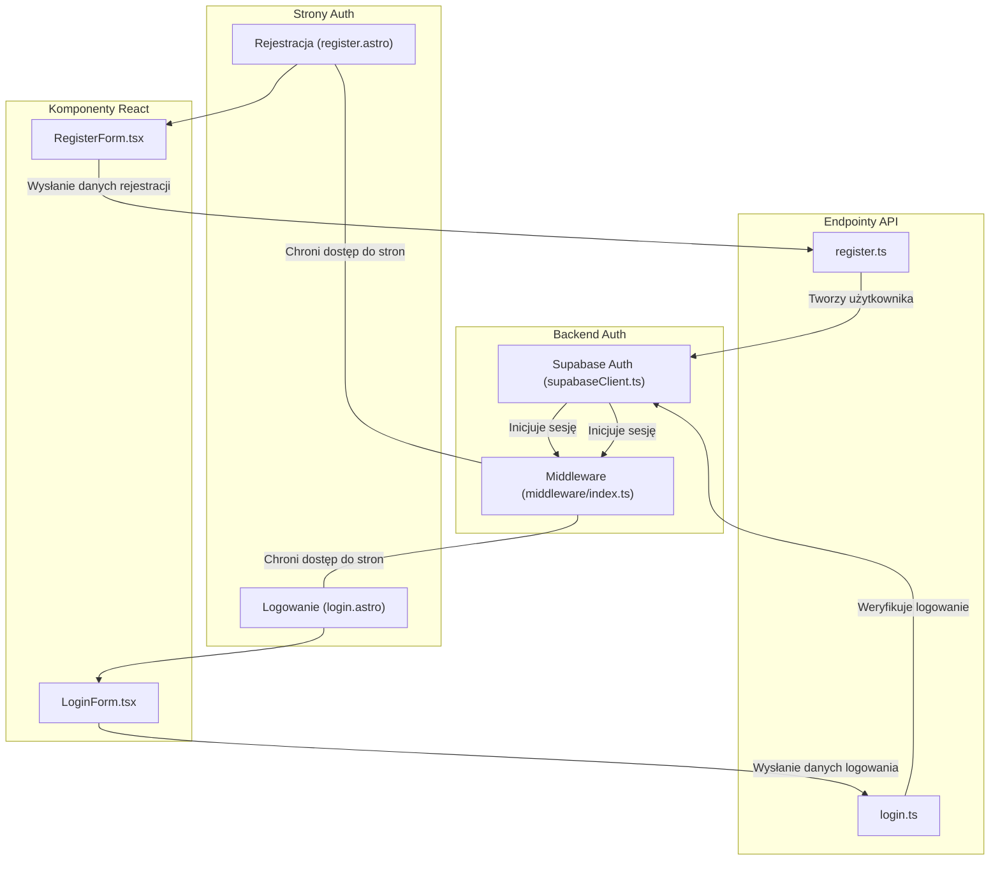

```mermaid
flowchart TD
  %% Strony Auth
  subgraph "Strony Auth"
    reg_page["Rejestracja (register.astro)"]
    login_page["Logowanie (login.astro)"]
  end

  %% Komponenty React
  subgraph "Komponenty React"
    reg_form["RegisterForm.tsx"]
    login_form["LoginForm.tsx"]
  end

  %% Endpointy API
  subgraph "Endpointy API"
    reg_api["register.ts"]
    login_api["login.ts"]
  end

  %% Backend Auth i Middleware
  subgraph "Backend Auth"
    supabase["Supabase Auth (supabaseClient.ts)"]
    middleware["Middleware (middleware/index.ts)"]
  end

  %% Przepływ rejestracji
  reg_page --> reg_form
  reg_form -- "Wysłanie danych rejestracji" --> reg_api
  reg_api -- "Tworzy użytkownika" --> supabase
  supabase -- "Inicjuje sesję" --> middleware

  %% Przepływ logowania
  login_page --> login_form
  login_form -- "Wysłanie danych logowania" --> login_api
  login_api -- "Weryfikuje logowanie" --> supabase
  supabase -- "Inicjuje sesję" --> middleware

  %% Dodatkowe powiązania
  middleware -- "Chroni dostęp do stron" --- reg_page
  middleware -- "Chroni dostęp do stron" --- login_page
```
