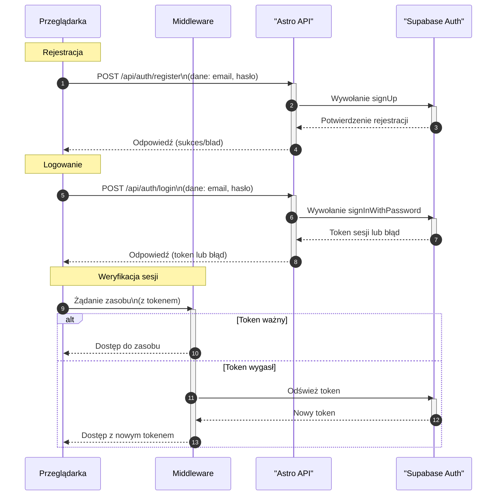

```mermaid
sequenceDiagram
  autonumber
  participant Przeglądarka
  participant Middleware
  participant "Astro API"
  participant "Supabase Auth"

  %% Rejestracja użytkownika
  Note over Przeglądarka: Rejestracja
  Przeglądarka->>"Astro API": POST /api/auth/register\n(dane: email, hasło)
  activate "Astro API"
  "Astro API"->>"Supabase Auth": Wywołanie signUp
  activate "Supabase Auth"
  "Supabase Auth"-->>"Astro API": Potwierdzenie rejestracji
  deactivate "Supabase Auth"
  "Astro API"-->>Przeglądarka: Odpowiedź (sukces/blad)
  deactivate "Astro API"

  %% Logowanie użytkownika
  Note over Przeglądarka: Logowanie
  Przeglądarka->>"Astro API": POST /api/auth/login\n(dane: email, hasło)
  activate "Astro API"
  "Astro API"->>"Supabase Auth": Wywołanie signInWithPassword
  activate "Supabase Auth"
  "Supabase Auth"-->>"Astro API": Token sesji lub błąd
  deactivate "Supabase Auth"
  "Astro API"-->>Przeglądarka: Odpowiedź (token lub błąd)
  deactivate "Astro API"

  %% Weryfikacja sesji i odświeżanie tokenu
  Note over Middleware,Przeglądarka: Weryfikacja sesji
  Przeglądarka->>Middleware: Żądanie zasobu\n(z tokenem)
  activate Middleware
  alt Token ważny
    Middleware-->>Przeglądarka: Dostęp do zasobu
  else Token wygasł
    Middleware->>"Supabase Auth": Odśwież token
    activate "Supabase Auth"
    "Supabase Auth"-->>Middleware: Nowy token
    deactivate "Supabase Auth"
    Middleware-->>Przeglądarka: Dostęp z nowym tokenem
  end
  deactivate Middleware
```
